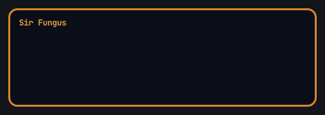

# 🕹️ QuestBox

**Retro RPG textbox & GIF maker.** Create animated retro‑JRPG dialogue boxes — typewriter text, colored words, a character name, and a final *Yes / No* menu with a selection arrow — then export them as a looping **GIF** or a **PNG**, entirely in your browser.

☕ [Buy me a coffee](https://buymeacoffee.com/lbellinz) · 🌐 Live demo: `https://<your-username>.github.io/questbox/`



## Features

- **Live editor** — the animation updates as you type.
- **Multi‑box sequences** — add, remove, reorder and duplicate dialogue boxes.
- **Typewriter effect** with adjustable speed (ms/char) and automatic **pauses after punctuation** (`. ! ?`).
- **Colored words** — select any word and give it a color.
- **Final menu** (e.g. *Yes / No*) with a blinking **▶ selection arrow**.
- **Full timing control** — pause before each box, reading pause, pause between boxes, final menu duration, blinking "continue" arrow.
- **10 style presets** (generic names, three free fonts) + full manual styling of colors, border, corner radius, box width and font.
- **Photo overlay** — drop in your own image and composite the textbox over it (your photo stays in your browser and is **never uploaded**).
- **Export** — optimized looping **GIF** (delta‑frame encoded) and full‑color **PNG** of any chosen frame.
- **Bilingual UI** — English / Italian, switchable on the fly.

## 100% client‑side

Everything runs in the browser: no backend, no build step, no network calls to generate images. Plain HTML + CSS + JS with the fonts and the GIF encoder embedded (no external requests), so it works offline, opened as a local file, or served from any sub‑path.

## Use it

Open `index.html` in any modern browser — or publish it (below) and use the live link.

## Deploy on GitHub Pages

1. Push this repository to GitHub.
2. Repository **Settings → Pages → Build and deployment → Source: Deploy from a branch**, branch `main`, folder `/ (root)`.
3. Your tool goes live at `https://<your-username>.github.io/questbox/`.

Because everything is inlined in one file, it works correctly from a project sub‑path with no extra configuration.

## Tech

- Vanilla JavaScript + HTML + CSS + Canvas — no framework, no build step, no ES modules (plain classic scripts, so it runs straight from `file://`).
- In‑browser GIF encoding via **gifenc** (MIT), delta‑frame optimized (only changed pixels per frame → small files).
- Embedded fonts (base64): **JetBrains Mono**, **VT323**, **Pixelify Sans** — all SIL Open Font License.

### Project structure

```
index.html          markup only
css/styles.css       styles
js/vendor/gifenc.js  GIF encoder (window.gifenc)
js/fonts.js          the three fonts as base64 (window.__FONTS__)
js/app.js            all the application logic
```

## Licenses

- Project code: **MIT** — see [`LICENSE`](LICENSE).
- Bundled fonts: **SIL OFL 1.1** — see [`licenses/`](licenses/).
- gifenc: **MIT** — see [`licenses/gifenc-MIT.txt`](licenses/gifenc-MIT.txt).

No trademarks, game names, fonts or assets from commercial games are used. The style presets are original, generically‑named looks inspired only by broad retro‑RPG aesthetics.
